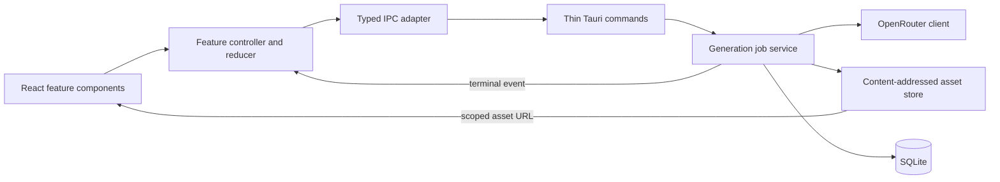

# Eidos Studio architecture

Eidos is a Tauri desktop application with a React presentation layer and a Rust application core. The frontend owns transient UI state. Rust owns credentials, provider traffic, job execution, local files, and durable metadata.

## Runtime boundaries



- `src/App.tsx` chooses the application screen; it does not contain the generation workflow.
- `src/features` contains feature UI, controller hooks, and explicit state transitions.
- `src/shared/eidosApi.ts` is the only frontend module that knows Tauri command or event names.
- `src-tauri/src/commands.rs` validates command-boundary input and delegates application work.
- `src-tauri/src/generation.rs` owns generation job lifecycle and cancellation.
- `src-tauri/src/openrouter.rs` is an injectable provider adapter; tests point it at a loopback server.
- The Rust model catalog starts from a curated fallback and refreshes supported capabilities from OpenRouter when a key is available. React only renders settings reported for the selected model.
- `src-tauri/src/db.rs` owns migrations and transactional metadata changes.
- `src-tauri/src/asset_store.rs` owns managed files and atomic, content-addressed writes.
- SQLite runs on a dedicated database thread; async jobs submit short operations instead of waiting on a blocking mutex.

## Generation contract

`start_generation` is an acceptance command, not a five-minute request/response call:

1. Rust validates the request, persists a `running` attempt, creates a cancellation token, and returns its request ID.
2. The job runs independently. Rust accepts at most two simultaneous jobs; this limit is enforced even if a caller bypasses the current UI.
3. `cancel_generation` addresses one request ID.
4. Exactly one terminal `generation-job-updated` event reports `succeeded`, `failed`, or `cancelled`.
5. The frontend reducer ignores events for a different request ID. A future comparison feature can keep the same event contract and store a map of reducers keyed by request ID.

The current provider adapter receives a terminal image response rather than intermediate progress, so the event describes lifecycle completion rather than fabricated percentage progress.
Cancellation is honored while waiting for the provider. Once the provider returns a decoded image, Eidos saves that potentially billed result even if cancellation arrives a moment later.

## Asset and persistence invariants

- Image bytes never cross the Tauri IPC boundary. Commands and events return managed paths, and React renders them through Tauri's scoped asset protocol.
- Persistent objects are named by SHA-256 content hash and recorded with paths relative to the asset root, so identical bytes have one portable managed file and can be linked to multiple attempts.
- `assets` describes unique objects. `attempt_assets` links those objects to attempts by role and order.
- A successful attempt and its output link are committed in one SQLite transaction.
- Files are written to a unique partial path and renamed into place before the database transaction.
- At startup, stale `running` attempts become `failed` and session-only selections are cleared. Reconciliation compares content hashes rather than machine-specific paths.
- During startup recovery, unreferenced objects are moved to `assets/orphaned` and unknown files are left untouched. User-requested deletions are queued in the same SQLite transaction as the history deletion, retried at startup, and remove originals plus thumbnails once no history items reference them.

SQLite cannot share an atomic transaction with the filesystem. The write ordering and startup reconciliation are the deliberate consistency mechanism.

## Security boundary

- The API key is stored in the operating-system credential store and is never returned to React or written to SQLite.
- The main window receives an explicit allow-list of application commands plus event listen/unlisten; it does not receive Tauri's broad default capability set.
- The asset protocol is restricted to `$APPDATA/assets/**`.
- Reference files are validated as supported raster formats and copied into managed storage before use.
- Provider response bodies and decoded images have independent size limits.
- If recording an error in SQLite also fails, the provider error remains primary and the storage failure is attached as secondary detail.

## Adding future features

- History uses cursor-paged Rust/SQLite queries and returns metadata plus managed paths; it does not send image bytes across IPC. The grid uses 512 px managed thumbnails while the inspector and lightbox retain the original image.
- Extend model discovery through the existing Rust provider/catalog boundary and normalized `list_image_models` IPC contract; keep provider-specific response shapes out of React.
- Comparison should maintain `Record<requestId, GenerationState>` (or an equivalent store) and reuse the existing start/cancel/event protocol.
- If the application gains deep links or independently navigable pages, add a router then. Screen extraction already keeps that change outside the feature logic.

## Quality gates

Run all frontend checks from the repository root:

```bash
pnpm check
```

Run the Rust gates from `src-tauri`:

```bash
cargo fmt --all -- --check
cargo clippy --all-targets --all-features -- -D warnings
cargo test --all-targets --all-features
```

The same gates run in GitHub Actions.
