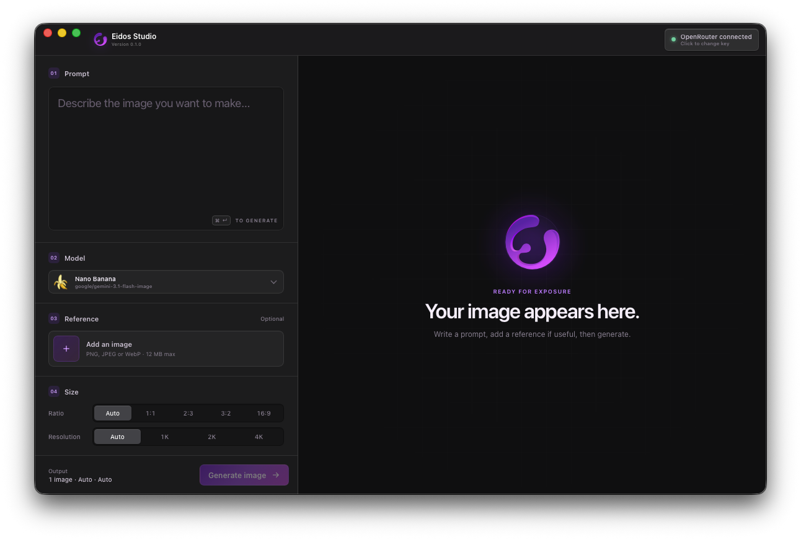

[](https://github.com/edge-patrick/eidos-studio/actions/workflows/ci.yml)
[](LICENSE)
[](#run-it-locally)
[](https://v2.tauri.app/)

# Eidos Studio

Eidos Studio is a local-first desktop app for generating images with AI using your `OpenRouter` credits. No accounts, sign-in, ads, tracking, or subscriptions.

<p align="center">
  
</p>

## Why?

If you are a designer, marketer, or copywriter, you may only need AI-generated
images here and there. At current 1K prices, you would need to generate about
300 images every month to make a $20 Google AI Pro subscription worth it for
image generation alone.

| | Eidos Studio | Google AI Pro |
| --- | --- | --- |
| Billing | ✅ Pay only when you generate | ❌ Pay about $20 every month |
| 50 images | ✅ About $3.35 | ❌ About $20 for the plan |
| Output controls | ✅ Choose aspect ratio, 1K, 2K, or 4K | ❌ Fewer explicit controls |
| Model choice | ✅ Choose among three Gemini image tiers | ❌ Gemini only |
| Cost visibility | ✅ See the exact cost of every image | ❌ No per-image dollar cost |
| Storage | ✅ Keep your library locally on your Mac | ❌ Tied to your Google account |
| Source code | ✅ Free and open source | ❌ Closed source |

*Estimate based on current 1K [Gemini API pricing](https://ai.google.dev/gemini-api/docs/pricing); input and OpenRouter credit-purchase fees are extra.*

## Supported models

- `google/gemini-3.1-flash-lite-image` — Nano Banana 2 Lite (1K)
- `google/gemini-3.1-flash-image` — Nano Banana 2 (1K, 2K, or 4K)
- `google/gemini-3-pro-image` — Nano Banana Pro (1K, 2K, or 4K)

## What it can do

- Generate an image from a text prompt
- Use up to 14 ordered local images as references (12 MB each, 48 MB combined)
- Switch models while keeping model-specific settings separate
- Choose a supported aspect ratio and resolution for the selected model
- Browse successful, failed, and cancelled generations in a local image library
- Reuse prompts, settings, and reference images from earlier generations
- Save generated images elsewhere or permanently delete them from local storage
- Open the local library without connecting an API key

Prompts and reference images stay in the local Eidos library, but they are sent to OpenRouter and the model provider when you generate an image.

## What's new in 0.3.1

Version 0.3.1 adds up to 14 ordered reference images per generation, with reordering, safe per-image and combined size limits, efficient reference thumbnails, and complete multi-reference reuse from the local Library.

## Roadmap

- [x] Text-to-image generation
- [x] Reference images
- [x] Local generation history
- [x] Aspect ratio and resolution controls
- [x] Polished interface and refreshed branding
- [x] A full history and image library
- [x] Multiple reference images
- [x] Multiple Gemini models with capability-aware settings
- [ ] More image models and settings
- [ ] Side-by-side model comparison
- [ ] More ways to save and share generated images
- [ ] Keyboard shortcuts and accessibility improvements
- [ ] Signed macOS release
- [ ] Windows and Linux support

## Run it locally

You will need Node.js, pnpm, Rust, and Xcode or the Xcode Command Line Tools.

```bash
pnpm install
pnpm tauri dev
```

When the app opens, enter your OpenRouter API key and start creating.

## Built with

- Tauri 2
- React and TypeScript
- Rust
- SQLite
- OpenRouter
